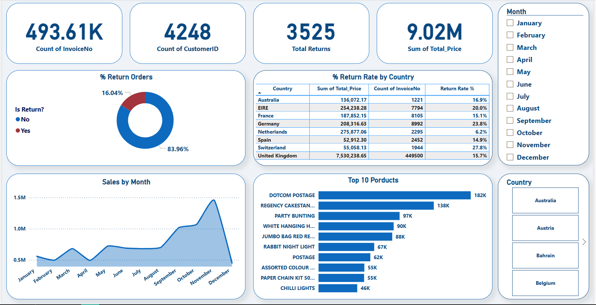

# E-Commerce Sales Analysis

## Dashboard Preview

## Problem 
The company needs a comprehensive analysis of e-commerce sales and returns across products, countries, and time to support data-driven decision-making.

## Data
- Source: E-commerce transactions dataset (`Book1.xlsx`).  
- Content: Invoices, Customers, Products, Prices, and Returns.  

##  Tools
- **Excel** → Data cleaning & preparation.  
- **Power BI** → Data modeling, DAX measures, and dashboard visualization.  

##  Preparation
Before analysis, the data was cleaned and transformed using Power Query in Power BI to ensure data quality and consistency. The key steps included:

-   **Data Type Correction:** Ensured each column had the appropriate data type (e.g., `InvoiceDate` to Date/Time, `UnitPrice` to Fixed Decimal).
-   **Handling Nulls:** Checked for and handled missing values, particularly in `CustomerID` and `Description`.
-   **Removing Duplicates:** Checked for and removed any duplicate transaction rows.
-   **Calculated Columns:** Created new columns where necessary, such as `Total_Price` (`Quantity` * `UnitPrice`) and the `Is_Return` flag.

## Analysis
- **Total Sales:** 9.02M  
- **Total Invoices:** 493K+  
- **Unique Customers:** 4,248  
- **Returns:** 16% overall (highest in Switzerland at 27.8%).  
- **Sales by Month:** Significant peak in **November**.  
- **Top Products:** DOTCOM POSTAGE, REGENCY CAKESTAND, PARTY BUNTING.  

## 6. Insights and Recommendations

Based on the analysis, the following key insights were identified:

-   **Geographic Performance:** The United Kingdom is the largest market, significantly outweighing sales from other countries.
    -   **Recommendation:** Develop targeted marketing campaigns for the UK market and investigate strategies to increase presence in other high-potential countries.
-   **Product Performance:** A small number of products account for a large percentage of total sales.
    -   **Recommendation:** Ensure optimal stock levels for best-selling items. Consider promotional bundles to increase the sales of less popular products.
-   **Return Rate Analysis:** The dashboard provides a clear view of the return rate.
    -   **Recommendation:** Continuously monitor the return rate. If it increases, perform a deeper analysis to identify the products or reasons associated with high returns to improve product quality or descriptions.

